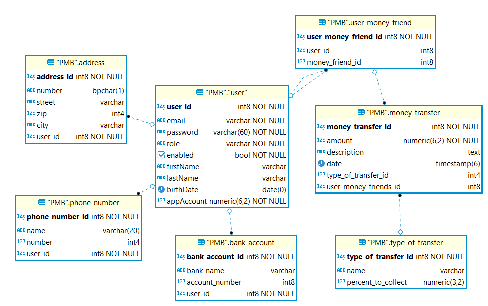

PayMyBuddyApp (training project)
=============

PayMyBuddyApp allows to anyone who is registered to this app to send money to friends.
Friends are called "connections".

Class Diagram
-------------

MPD
-------------

Technologies used
-----------------
* Spring boot
* Spring Web
* Spring Security
* PostgreSQL JDBC driver
* Maven