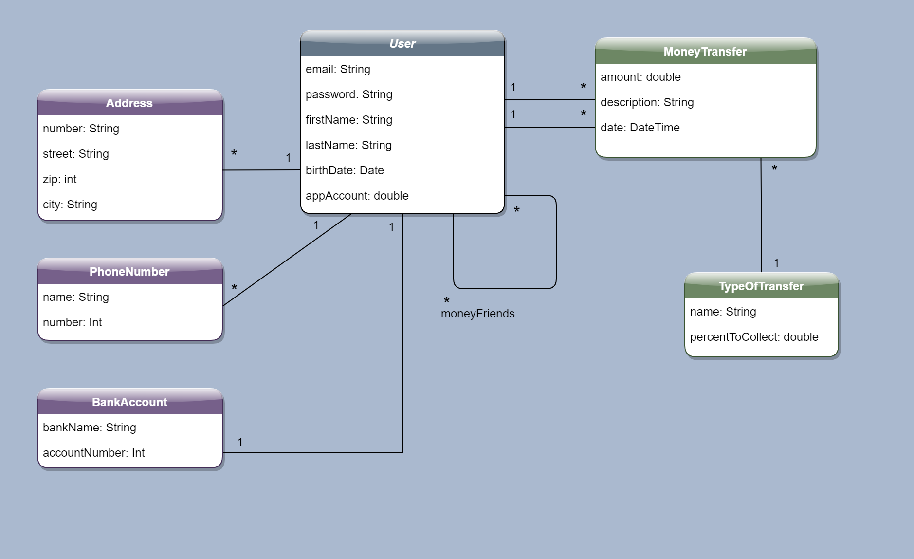
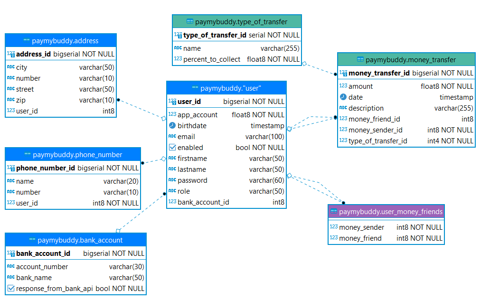

PayMyBuddyApp (training project)
=============

PayMyBuddyApp allows to anyone who is registered to this app to send money to friends who are also registered.

Class Diagram
-------------

MPD
-------------

Technologies used
-----------------
* Spring boot
* Spring Web
* Spring Security
* PostgreSQL JDBC driver
* Hibernate
* Jpa Repository
* Maven

Setting BDD
-----------------
This project use Hibernate so the BDD can be created on the launch of the application.
 In properties file : just set : <b>spring.jpa.hibernate.ddl-auto</b> to <b>create</b>
 
 Some data have to be inserted before use. These are in the data.sql file present in the resources folder. 

 Or you can process as follow :

#Exemple : setting BDD with PgAdmin 4 and data

* First, create a new Role
* Name it PMB and give it all rights
* create a database named paymybuddy
* set PMB as owner
* save
* right-clic on database paymybuddy and go to sql editor
* paste content of the paymybudy.sql file and data.sql file present in the resources folder
* execute

Now the database is set and the table "type_of_transfer" contains data.